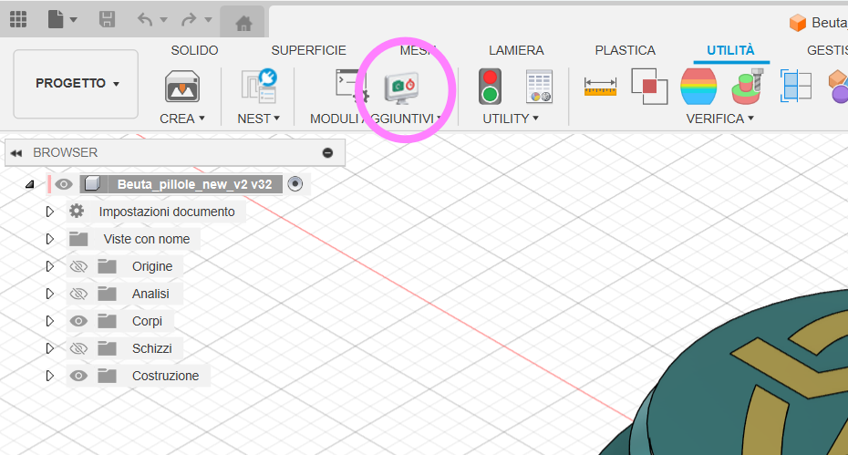
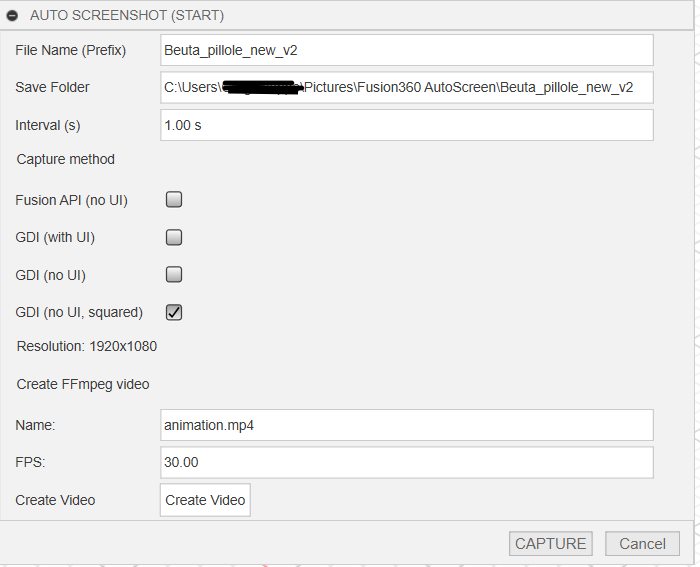
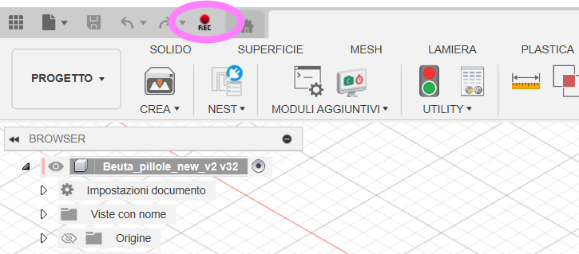
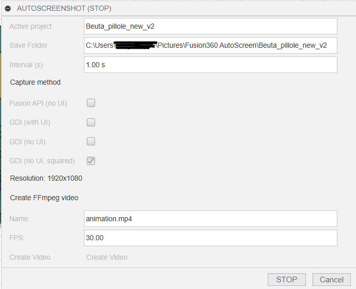

# AutoScreenshot for Fusion 360

**AutoScreenshot** is a plugin for Autodesk Fusion 360 that automatically captures screenshots of your project over time. It's ideal for documenting your workflow, creating time-lapse videos, or reviewing your design progress.

---

## ✨ Features

- 📷 **Four capture modes**:
  - **Fusion API-based** — Uses Fusion's internal `viewport.saveAsImage()` (may cause the viewcube to freeze).
  - **GDI capture with UI** — Captures the entire Fusion window including interface elements.
  - **GDI capture without UI** — Captures only the modeling area.
  - **GDI square no-UI** — Captures a square portion of the modeling area, ideal for social media content.

- ⏸ **Automatic pause and resume**:
  - Capture **pauses automatically** when Fusion is minimized or when you switch to another document.
  - It **resumes automatically** when the original document is reactivated.

- 📁 **File naming and ordering**:
  - Screenshots are saved with filenames based on the current date and time, ensuring alphabetical order.
  - This approach:
    - Prevents duplicate files during multiple capture sessions.
    - Maintains an ordered sequence for time-lapse creation.
    - Facilitates manual editing or trimming before merging.
  - ⚠ **Important**: Renaming the files manually is discouraged — tools like `ffmpeg` rely on the alphabetical order of filenames to merge frames correctly into a video.

---

## 📷 Preview

<div align="center">

<table>
  <tr>
    <td align="center" valign="bottom" width="320">
      <a href="readme_images/1.png" target="_blank">
        
      </a>
      <br/>
      <sub>Addin Icon location</sub>
    </td>
    <td align="center" valign="bottom" width="320">
      <a href="readme_images/2.png" target="_blank">
        
      </a>
      <br/>
      <sub>Pre-Capture settings</sub>
    </td>
  </tr>
  <tr>
    <td align="center" valign="bottom" width="320">
      <a href="readme_images/3.png" target="_blank">
        
      </a>
      <br/>
      <sub>Capture alert (yellow if paused)</sub>
    </td>
    <td align="center" valign="bottom" width="320">
      <a href="readme_images/4.png" target="_blank">
        
      </a>
      <br/>
      <sub>Stop capture screen</sub>
    </td>
  </tr>
</table>

</div>


## 🧪 Installation

### 1. Install AutoScreenshots for Fusion360 on windows

1. Download the entire zip folder of the package
2. go to (Win + r, then paste and hit enter): ```text %APPDATA%\Autodesk\Autodesk Fusion 360\API\AddIns``` 
3. Extract the package in the folder and delete the -main suffix from the dirname; so the manifest.json is in "%APPDATA%\Autodesk\Autodesk Fusion 360\API\AddIns\Autoscreenshots\manifest.json"
4. Reload Fusion360

You can now use `AutoScreenshots` from Fusion360 panels, in Tools-> Addins

---

## ▶️ How to use

1. Open your saved project in Fusion 360.
2. Launch the add-in from the **Tools > Add-Ins** panel.
3. Click **Capture** to start screenshot recording.
4. When you're done, re-open the command panel and click **Stop** to end the session.

Captured images will be stored in the `output` folder inside the add-in directory.

---

## 📼ffmpeg installation

### 1. Install FFmpeg on Windows

1. Download FFmpeg from [https://ffmpeg.org/download.html](https://ffmpeg.org/download.html).
2. Extract the zip to `C:\\ffmpeg`.
3. Add `C:\\ffmpeg\\bin` to your system `PATH`:

```text
   - Press Win + R, type sysdm.cpl, and press Enter.
   - Go to Advanced > Environment Variables.
   - Under System variables, find Path, click Edit, then New, and add:
     C:\\ffmpeg\\bin
   - Click OK and restart the terminal or your PC.
```

You can now use `ffmpeg` from any terminal or command prompt.


## 🧠 Notes

- Fusion's internal screenshot function may cause the viewcube to freeze. For consistent results, prefer **GDI capture** modes.
- Screenshots are saved in the background without affecting your design process.
- The plugin automatically handles pauses and resumes based on Fusion's window state and active document.
- Files are not managed, so YOU NEED TO DELETE IT once done, they are stored into Users Image folder, under Fusion360 AutoScreenshots directory.

---

## 📄 License

MIT License

---

## 👨‍💻 Author

Developed for designers and engineers who want to document their 3D workflows.
Let me drink a beer! 🍺  
[](https://www.paypal.com/donate?business=FLZVTMNJVW9D2&no_recurring=0&item_name=Fusion360+AutoScreenshots+contribute&currency_code=EUR)
